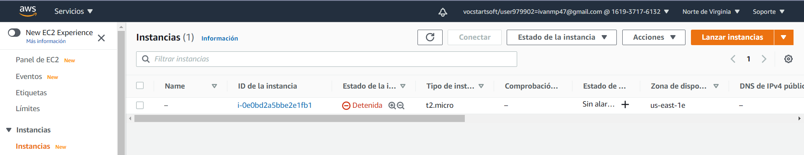

# Práctica 2 - Instalación en AWS

## 1. Instalación de la AMI 

Una **AMI** \(Amazon Machine Image\) es una imagen que nos permite lanzar una máquina virtual en **AWS** \(Amazon Web Services\).

Para empezar a trabajar con ella, nos iremos a la consola AWS, donde nos aparecerá una serie de servicios que Amazon nos proporciona. El que necesitamos nosotros es **EC2** \(Elastic Compute Cloud\) que nos permitirá crear instancias \(máquinas virtuales\) a partir de estas AMI.

Al pulsar en EC2, entraremos en su panel de control, en la lista de la izquierda tendremos una opción llamada "**Instancias**", en ella podremos ver la lista de las que tengamos creadas y gestionarlas.



> Figura 1. Lista de instancias.

Si pulsamos en el botón naranja llamado "**Lanzar instancias**" nos moveremos a la lista de AMIs disponible. En esta práctica, se utilizará **Ubuntu Server 20.04**, utilizando el buscador podremos afinar la lista según nuestros criterios.


> Figura 2. Lista de AMIs que corresponden al criterio "Ubuntu".

Al seleccionar la máquina que queramos, tendremos una larga lista con las características disponibles para la misma. Al estar usando una licencia de AWS Educate, sólo podremos elegir los tipos de instancia gratuitos, en este caso será t2.micro.

En el siguiente paso podremos configurar diversas opciones para adecuar un poco más la máquina a nuestras necesidades, por ejemplo, podemos especificar cuántas instancias queremos crear, el número de CPUs \(en el caso de que el tipo de nuestra AMI tenga más de un núcleo de CPU\) o si estará unida a un dominio, entre muchas otras.


> Figura 3. Configuración adicional de nuestra instancia.

Seguimos y esta vez podremos especificar el espacio del disco de nuestra máquina. Con el espacio por defecr \(8 GiB\) tenemos suficiente por el momento. Lanzamos la máquina y nos aparecerá una ventana emergente donde podremos descargar una **clave PEM** que será necesaria para acceder a la máquina, creamos una nueva y la descargamos.


> Figura 4. Creando la llave PEM.

## 2. Conexión y autenticación

Antes de lanzar la instancia de nuestra máquina, debemos modificar los permisos de la clave PEM para que sea válida. Se explicará como hacerlo tanto para Linux como para Windows.

* **Linux**

Con un simple comando actualizamos los permisos necesarios:

```text
$ chmod 400 llave.pem
```

* **Windows**

Localizamos la llave y entramos en sus propiedades y después en la pestaña de seguridad, opciones avanzadas.

**Deshabilitamos la herencia** del archivo para que se eliminen todos los permisos sobre el mismo y pulsamos en agregar.

Introducimos nuestro usuario actual, aplicamos y aceptamos.


Podemos lanzar la instancia desde el panel de AWS seleccionándola y pulsando en el desplegable "**Estado de la instancia**", donde pulsaremos esta vez en "**Iniciar**".

Pulsamos en la ID de la instancia y en el botón "**Conectar**"


En la pestaña "**Cliente SSH**" anotamos el último comando y si lanzamos un terminal desde donde está localizada la clave \(o especificando la **ruta absoluta** de la misma\) nos conectaremos. Ejemplo del comando necesario:

```text
$ ssh -i "Key-IMP.pem" ubuntu@ec2-100-25-198-14.compute-1.amazonaws.com
```


> Figura 5. Conexión SSH a la máquina de AWS \(powershell\).

## Conexión a través de Visual Studio Code

Para lanzar el script que necesitaremos es mucho más cómodo utilizar un entorno de programación como Visual Studio Code que nos permita pegarlo y/o escribirlo de forma sencilla.

Podemos conectarnos a la máquina desde este programa si utilizamos la extensión "**Remote SSH**". Una vez instalada pulsamos la combinación "**Ctrl + shift + P**" y buscamos por el nombre de la extensión. Elegimos "**Open Configuration File...**" y escribimos lo siguiente:

```text
Host IAW-Practica-01
    HostName ec2-100-25-198-14.compute-1.amazonaws.com
    User ubuntu
    IdentityFile D:\Ivan\ASIR2\Key-IMP.pem
```

* **Nombre de Host:** Nombre personalizado que usará la extensión para identificar dónde se conecta.
* **Hostname:** Nombre del host especificado en los detalles de nuestra instancia.
* **User:** Nombre del usuario especificado en los detalles de nuestra instancia.
* **IdentityFile:** Ruta de la llave pem.

Después sólo tenemos que guardar el archivo y volver a pulsar la combinación de teclas mencionada anteriormente, esta vez ejecutaremos la opción "**Connect to Host...**" y se abrirá una ventana nueva en la que podremos trabajar. Allí simplemente podremos pegar el script creado en la práctica 1

ENLACE A SCRIPT

Y ejecutarlo por ssh o en la propia consola de Visual Studio Code.


> Figura 6. Conexión a través de Remote SSH desde Visual Studio Code.

Con el script ejecutado, probamos a acceder a la aplicación de LAMP que importamos en el script.


> Figura 7. Aplicación web funcionando desde el navegador.

Una vez terminemos de trabajar con la máquina, hay que recordar que debemos detener la instancia, también hay que tener en cuenta que cada vez que la lancemos la IP cambiará, por lo que deberemos modificar el archivo de configuración de Remote SSH.


