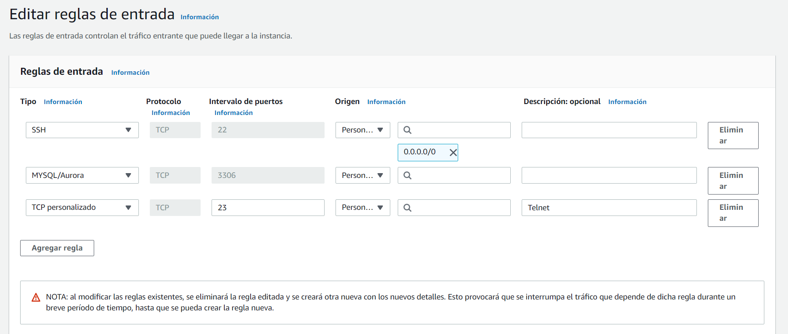
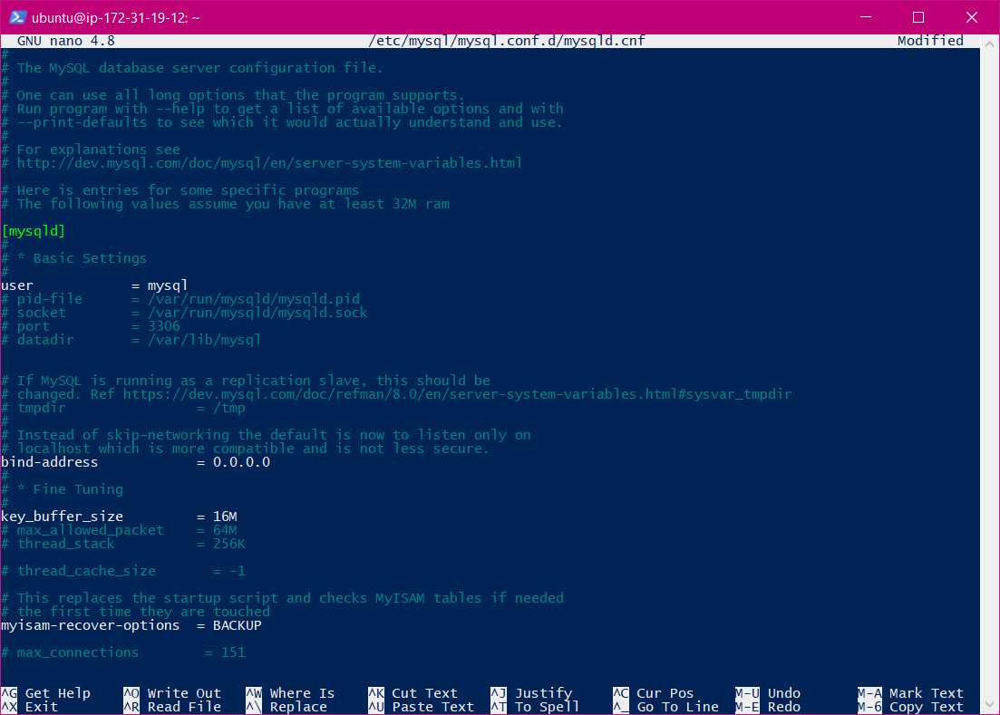
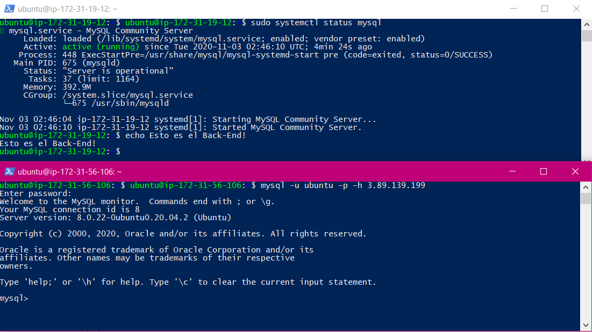

# Práctica 3 - LAMP en dos niveles

## 1. Creación y aprovisionamiento de las máquinas virtuales

Para empezar con la práctica, lanzaremos dos AMIs Ubuntu Server 20.04 en Amazon Web Services con las características básicas \(la tarifa gratuita para usuarios de AWS educate\). Debemos asegurarnos de que las máquinas tienen los puertos correspondientes abiertos, en el caso del back-end necesitaremos el **puerto 3306** activado.



> Figura 1. Asignación de los puertos de entrada en la AMI back-end.

Una de ellas actuará como el **front-end**, que contendrá la mayor parte de la pila LAMP instalada \(Apache y PHP\) mientras que la otra será el **back-end** __contando solamente con MySQL.

Como en la práctica anterior, se aprovechará un script para tener las máquinas preparadas lo antes posible, cada máquina tendrá su propio script.

* [Práctica 3 - Script Front-End](practica-3-script-front-end.md)
* [Práctica 3 - Script Back-End](practica-3-script-back-end.md)

Nos conectamos a través de Visual Studio Code y ejecutamos el script en cada una.

## 2. Configuración de MySQL Server en la máquina back-end

Con el script ya ejecutado en la máquina tenemos lo necesario para empezar a configurar el back-end, lo primero que haremos es editar el archivo `/etc/mysql/mysql.conf.d/mysqld.cnf` donde localizaremos el bloque **\[mysqld\]** para editar la opción **bind-address** mostrada en la captura:



> Figura 2. Editando el archivo mysqld.cnf

Esta opción dicta desde qué interfaz de red se escucharán conexiones a MySQL, por defecto tendremos la interfaz 127.0.0.1 \(localhost\), si en su lugar escribimos **0.0.0.0**, se escucharán todas las peticiones de conexión desde cualquier interfaz. En este caso sería de utilidad tenerlo así, ya que en cada reinicio de la AMI cambiará la IP y no tendremos que volver a editar el archivo. 

Una vez hecho, reiniciaremos el servicio de MySQL.

```text
$ sudo systemctl restart mysql
```

A continuación nos conectamos a MySQL:

```text
$ mysql -u root -p
```

Creamos el siguiente usuario y le damos permisos de acceso:

```text
mysql> CREATE USER 'ubuntu'@'%' IDENTIFIED BY 'root';
mysql> GRANT ALL PRIVILEGES ON '*.*' TO 'ubuntu'@'%';
mysql> FLUSH PRIVILEGES;
```

Con esto, lo que estamos haciendo es crear un usuario llamado Ubuntu con la contraseña "root" que tendrá activados todos los permisos posibles y podrá conectarse desde cualquier interfaz de red.

Desde la máquina front-end, probaremos a conectarnos a este servidor MySQL con el usuario que acabamos de crear.



> Figura 3. Conectándose al servidor MySQL desde el Front-End


