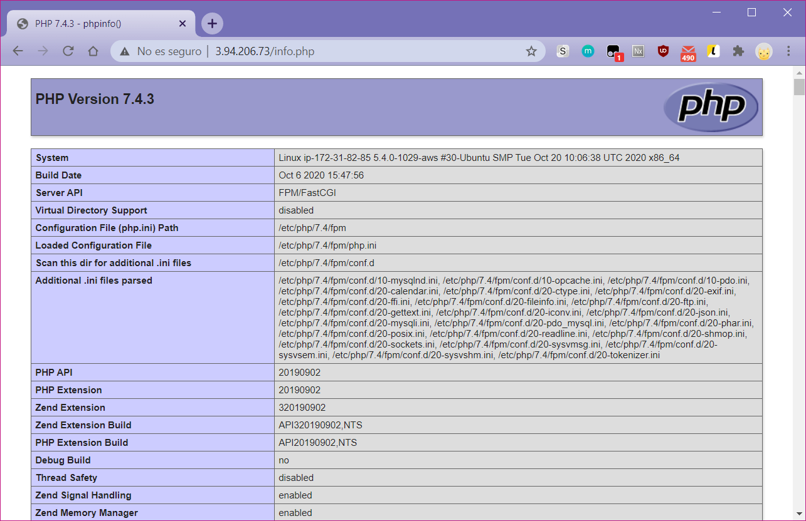

# Práctica 6 - Pila LEMP

**Los recursos necesarios para esta práctica están en el siguiente repositorio**

Esta pila funciona exactamente igual que la LAMP pero a diferencia de ella, se utilizará Nginx como servidor web, sustituyendo a Apache.

## 1. Creación de la máquina y aprovisionamiento

Se utilizará una AMI Ubuntu Server 20.04 para la práctica, el script con toda la configuración está alojado en el repositorio anteriormente citado y no hará falta ninguna configuración adicional para el funcionamiento de la máquina, pero se explicará a continuación el funcionamiento del mismo.

## 2. Configuración de la pila LEMP

**Todos estos pasos están realizados en el script pero se explicarán para demostrar la comprensión del mismo.**

Con la máquina de Linux creada quedarán tres componentes más para el funcionamiento de la pila, **Nginx**, **MySQL** y **PHP**. 

Se instalarán los componentes tras actualizar los repositorios:

```text
$ sudo apt update
$ sudo apt install nginx -y
$ sudo apt install php-fpm php-mysql -y
```

Tras esto se debe configurar el servidor Nginx para que utilice el **socket php-fpm**, para hacer esto se editará el archivo `/etc/nginx/sites-available/default` 

En él se localizará la línea **index** y se pondrá en primer lugar **index.php** para que utilice este formato antes que html, quedando así:

`index index.php index.html index.htm index.nginx-debian.html;`

Se añadirá el bloque siguiente para indicar la localización del socket, indicando que el servidor fast-cgi está localizado en la misma máquina \(localhost\):

```text
  location ~ \.php$ {
                include snippets/fastcgi-php.conf;
                # With php-fpm (or other unix sockets):
                fastcgi_pass 127.0.0.1:9000;
        }
```

Y este último bloque para evitar el acceso a los archivos .`htaccess` por seguridad:

```text
# deny access to .htaccess files, if Apache's document root
# concurs with nginx's one
location ~ /\.ht {
        deny all;
}
```

Hecho esto se comprobará que la sintaxis sea correcta y si lo es, se reiniciará el servicio para aplicar los cambios.

```text
$ sudo nginx -t
$ sudo systemctl restart nginx
```

Para comprobar que funciona correctamente accederemos al archivo info.php \(creado en las anteriores prácticas e incluído en el repositorio\) y nos conectaremos a la página web de la AMI:



> Figura 1. Comprobación de la correcta instalación y configuración de Nginx.

Después de esto será necesario configurar el socket en sí \(php-fpm\) por lo que se editará el archivo `/etc/php/7.4/fpm/pool.d/www.conf` y se buscará la línea **listen**, una vez localizada se editará para que contenga la dirección local y utilice el puerto 9000:

`listen = 127.0.0.1:9000`

Se reiniciará su servicio:

```text
$ sudo systemctl restart php7.4-fpm
```

Por último y por medidas de seguridad se deberá editar el archivo `/etc/php/7.4/fpm/php.ini` el cual es muy extenso, pero con este comando se podrá cambiar la línea necesaria sin tener que buscarla manualmente:

```text
$ sudo sed -i "s/;cgi.fix_pathinfo=1/cgi.fix_pathinfo=0/" /etc/php/7.4/fpm/php.ini
```

Con esto lo que se conseguirá es desactivar `PATH_INFO` para evitar que alguien ajeno conozca esta ruta y pueda subir scripts maliciosos al servidor.

